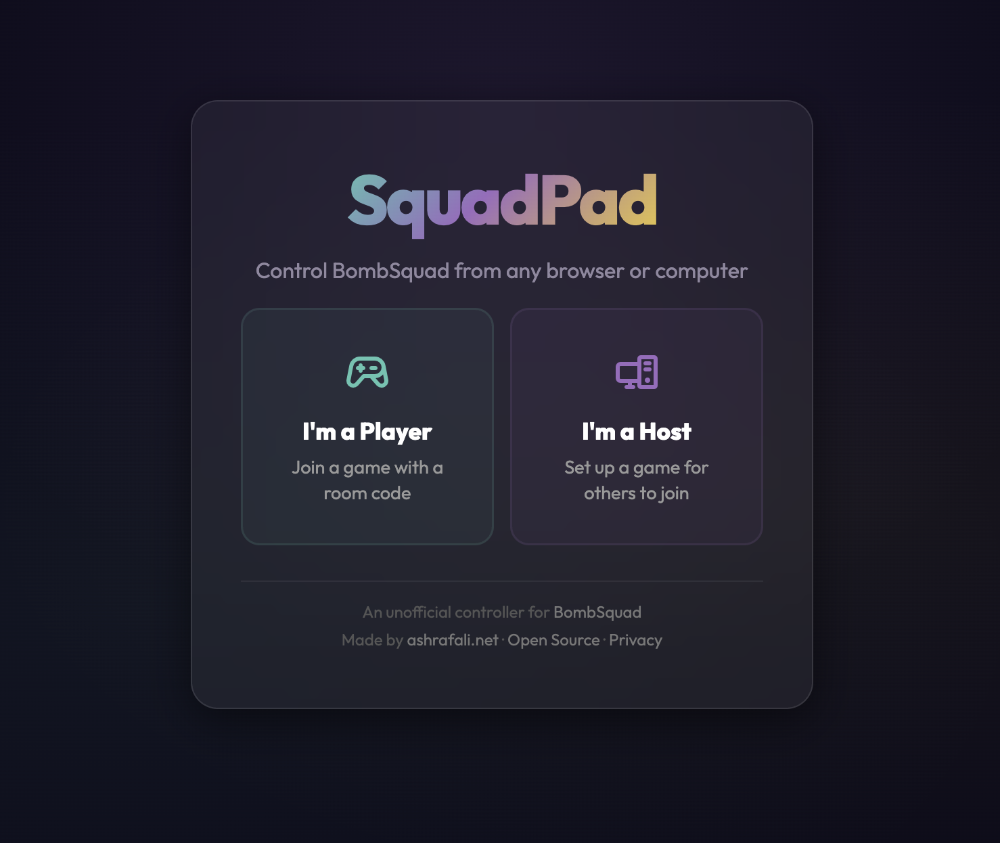
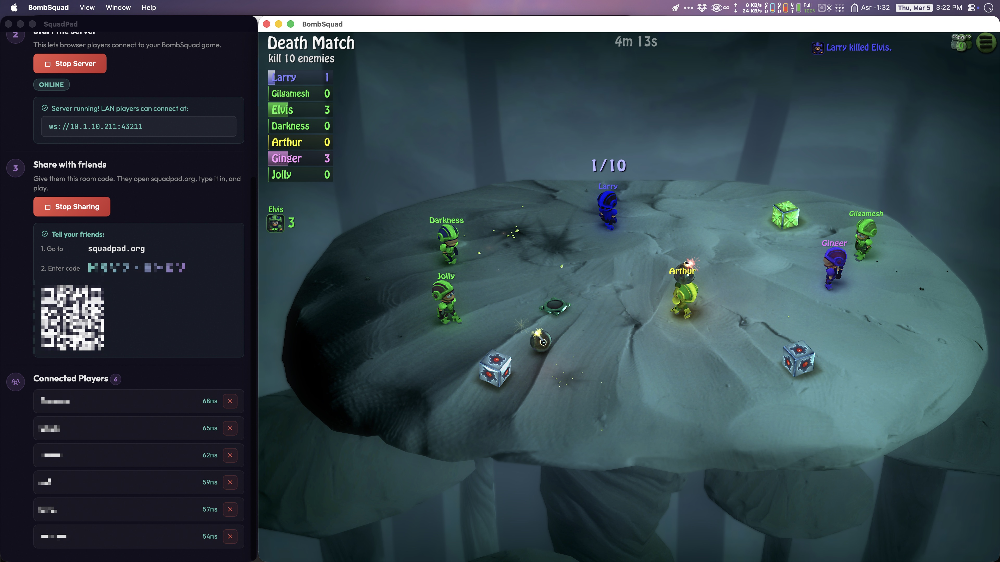

# SquadPad


An unofficial web-based controller for [BombSquad](https://www.froemling.net/apps/bombsquad). Open a browser, enter a room code, and play -- no app install required for players.

Website: [squadpad.org](https://squadpad.org)


## For Players

1. Open [squadpad.org](https://squadpad.org) on your phone or computer.
2. Click "I'm a Player".
3. Enter the room code the host gives you.
4. Tap Join -- you are in the game.

On touch screens you get a virtual joystick and action buttons. On desktop you can use the keyboard:

| Key   | Action |
|-------|--------|
| W/A/S/D | Move |
| K     | Jump   |
| J     | Punch  |
| L     | Throw  |
| I     | Bomb   |
| Shift | Run    |

Keyboard bindings can be changed in Settings (gear icon).


## For Hosts

The host runs a small desktop app alongside BombSquad on the same machine. The desktop app bridges browser controllers to BombSquad over UDP.

1. Download the SquadPad desktop app from the [Releases](https://github.com/nerveband/squadpad/releases) page (macOS, Windows, or Linux).
2. Start BombSquad and begin a party.
3. Open SquadPad and click "I'm a Host" -- this opens the Host Dashboard.
4. In the dashboard, click **Start Server** to begin accepting player connections.
5. Click **Go Online** to get a room code for internet play.
6. Share the room code with your friends. They open [squadpad.org](https://squadpad.org), enter it, and play.

The "Scan Network" button auto-discovers BombSquad instances on your LAN. If BombSquad is on the same machine, the default "localhost" works.


## How It Works

```
                        Internet play
                        =============

Browser (Player)  --WebSocket-->  Cloud Relay  --WebSocket-->  SquadPad Host App  --UDP:43210-->  BombSquad
                                  (Fly.io)                     (your machine)                     (Game)


                        LAN play
                        ========

Browser (Player)  --WebSocket (direct)-->  SquadPad Host App  --UDP:43210-->  BombSquad
```

Three components make this work:

1. **Web Controller UI** -- Static HTML/CSS/JS served from Netlify at squadpad.org. Renders touch controls and keyboard input, sends binary controller state over WebSocket.
2. **SquadPad Desktop App** -- A Tauri 2.x app with a Rust backend. Runs a local WebSocket server, translates controller messages to BombSquad's UDP protocol, and connects to the cloud relay for internet play.
3. **Cloud Relay** -- A lightweight Node.js WebSocket relay hosted on Fly.io. Pairs players with hosts using room codes so neither side needs port forwarding.


## Project Structure

```
squadpad/
  src/                    Web frontend (shared between Tauri + Netlify)
    index.html            Main page (player controller + role picker)
    host.html             Host dashboard (Tauri-only, server controls)
    css/style.css         All styles
    js/
      ui.js               Main app orchestrator
      controller.js       Virtual joystick + buttons + keyboard input
      connection.js       WebSocket connection to host/relay
      protocol.js         BombSquad V2 protocol encoding/decoding
      dashboard.js        Host dashboard logic (Tauri commands)
  src-tauri/              Rust backend
    src/
      main.rs             Tauri entry point
      lib.rs              Tauri command handlers
      protocol.rs         BombSquad UDP protocol (Rust)
      udp_client.rs       UDP socket management + discovery
      websocket_server.rs WebSocket server for browser players
      relay_client.rs     Cloud relay connection + binary bridge
      state.rs            App state (players, settings)
    Cargo.toml
    tauri.conf.json
  relay/                  Cloud relay server
    server.js             WebSocket relay with room codes
    package.json
    Dockerfile
    fly.toml
  tests/                  Test suite (Vitest)
    protocol.test.js
    controller.test.js
    connection.test.js
    relay.test.js
  .github/workflows/      CI/CD pipeline
  netlify.toml            Netlify deploy config
  docs/plans/             Design + implementation docs
```


## Development

### Prerequisites

- Node.js 20+
- Rust toolchain (for the Tauri desktop app)
- Tauri CLI: `cargo install tauri-cli`

### Web Controller UI

```bash
# Install dependencies
npm install

# Start local dev server on port 3000
npm run dev

# Run tests (Vitest)
npm test

# Run tests in watch mode
npm run test:watch
```

The web UI is plain HTML/CSS/JS in the `src/` directory -- no build step, no framework.

### Tauri Desktop App

```bash
# Development mode (opens app window + hot-reloads web UI)
cd src-tauri && cargo tauri dev

# Production build
cd src-tauri && cargo tauri build
```

Rust source lives in `src-tauri/src/`. Key modules:

- `lib.rs` -- Tauri command handlers (discover games, start/stop server, share online, manage players)
- `protocol.rs` -- BombSquad binary protocol encoding
- `udp_client.rs` -- UDP communication with BombSquad
- `websocket_server.rs` -- Local WebSocket server for player connections
- `relay_client.rs` -- Cloud relay connection and binary frame bridging
- `state.rs` -- Shared application state

### Relay Server

```bash
cd relay
npm install
PORT=43212 node server.js
```

Or with Docker:

```bash
cd relay
docker build -t squadpad-relay .
docker run -p 43212:43212 squadpad-relay
```

Deploy to Fly.io:

```bash
cd relay
fly launch --name my-squadpad-relay
fly deploy
```

Players can point to a custom relay by appending `?relay=wss://your-relay.example.com` to the SquadPad URL, or via localStorage:

```js
localStorage.setItem('squadpad_relay_url', 'wss://your-relay.example.com');
```

### CI/CD

GitHub Actions runs on every push and PR to `master`:

- **test** -- `npm install && npm test` (Node.js 20, Ubuntu)
- **build** -- Tauri cross-platform build for macOS (ARM + x86), Linux, and Windows

Hosting:

- Web UI: Netlify (squadpad.org via Cloudflare DNS)
- Relay: Fly.io (squadpad-relay.fly.dev)


## Protocol

See [docs/PROTOCOL.md](docs/PROTOCOL.md) for the full protocol reference covering:

- Browser ↔ Relay WebSocket protocol (JSON + binary)
- Relay ↔ Host binary forwarding
- Host ↔ BombSquad UDP protocol (V2, port 43210)
- Relay room lifecycle, limits, and health check
- Local WebSocket server for LAN play


## Tech Stack

| Layer          | Technology                                    |
|----------------|-----------------------------------------------|
| Web UI         | HTML, CSS, vanilla JavaScript                 |
| Desktop app    | [Tauri 2.x](https://v2.tauri.app/) (Rust backend, web frontend) |
| Relay server   | Node.js, [ws](https://github.com/websockets/ws) (WebSocket library) |
| Tests          | [Vitest](https://vitest.dev/)                 |
| Hosting        | [Netlify](https://www.netlify.com/) (web), [Fly.io](https://fly.io/) (relay) |
| CI/CD          | [GitHub Actions](https://github.com/features/actions) |
| DNS            | [Cloudflare](https://www.cloudflare.com/)     |

### Libraries & Tools

| Library | Purpose | Link |
|---------|---------|------|
| [Tauri](https://v2.tauri.app/) | Desktop app framework (Rust + web) | [github.com/tauri-apps/tauri](https://github.com/tauri-apps/tauri) |
| [tokio-tungstenite](https://crates.io/crates/tokio-tungstenite) | Async WebSocket client/server (Rust) | [github.com/snapview/tokio-tungstenite](https://github.com/snapview/tokio-tungstenite) |
| [ws](https://www.npmjs.com/package/ws) | Node.js WebSocket library (relay server) | [github.com/websockets/ws](https://github.com/websockets/ws) |
| [qrcode-generator](https://www.npmjs.com/package/qrcode-generator) | QR code rendering on host dashboard | [github.com/nicoleahmed/qrcode-generator](https://github.com/nicoleahmed/qrcode-generator) |
| [Phosphor Icons](https://phosphoricons.com/) | Bold icon set for UI | [github.com/phosphor-icons/web](https://github.com/phosphor-icons/web) |
| [Outfit](https://fonts.google.com/specimen/Outfit) | Primary UI font | Google Fonts |
| [JetBrains Mono](https://fonts.google.com/specimen/JetBrains+Mono) | Monospace font for codes & data | Google Fonts |
| [Vitest](https://vitest.dev/) | Unit testing framework | [github.com/vitest-dev/vitest](https://github.com/vitest-dev/vitest) |


## Privacy & Analytics

SquadPad uses [Umami](https://umami.is), a privacy-focused, open-source analytics tool. Umami does not use cookies, does not track users across sites, and does not collect personal information. Analytics are self-hosted. See the [Privacy Policy](https://squadpad.org/privacy.html) for details.

The cloud relay temporarily holds connection data (room code, player name, IP for rate limiting) while you play and deletes everything on disconnect. No gameplay data is logged or stored.


## Screenshots







## Credits

Made by [Ashraf Ali](https://ashrafali.net).

BombSquad is created by Eric Froemling -- [froemling.net/apps/bombsquad](https://www.froemling.net/apps/bombsquad).

SquadPad is an independent project and is not affiliated with or endorsed by Eric Froemling or BombSquad.


## License

MIT -- see [LICENSE](LICENSE) for details.
